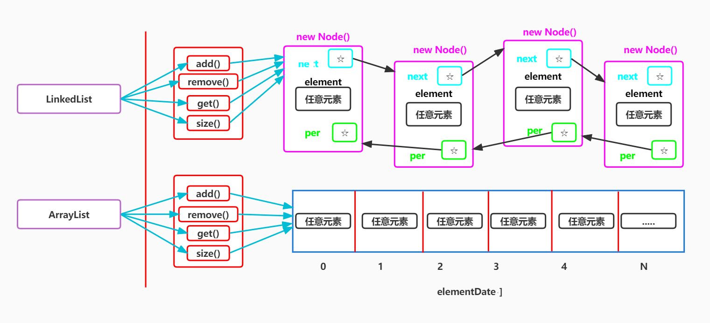

# HandWritingcollection
Hand Writing Array List And Linked List
手撕ArrayList和LinkedList集合
本人通过翻看ArrayList和LinkedList底层源码，分析了其设计思想，将作者当时如何设计的思想，每一步都通过注释解释了出来😎
有想了解底层设计思路的朋友可以自行学习查看😁
虽然代码简单，但是作为初学者的我来说设计思想很可贵💕
实现思路图：

